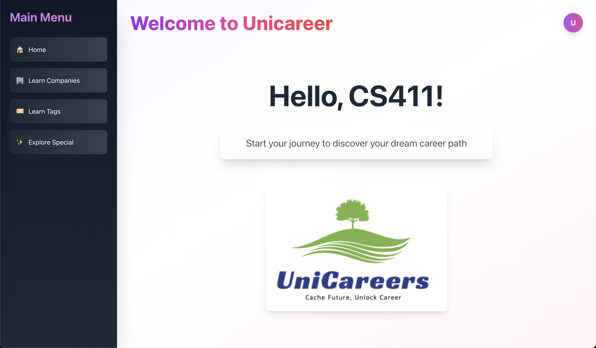

Welcome to the official repository for **CacheFOUR**!

🚀 **Project:** UniCareers  
🌟 **Tagline:** Empowering college students to explore career paths and academic opportunities.  

## About UniCareers
UniCareers is a web application designed to help university students connect their academic pursuits with future career goals. By bridging the gap between education and employment, UniCareers offers:

- **Layer-Based Visualization:** Navigate career paths from broad industries to specific roles using SOC codes.
- **Course Matching Job Demo:** Link your completed courses to potential jobs and plan future academic paths.

## Core Features
1. **Profile:** Create, customize, and update personal details for tailored recommendations.
2. **Learn Companies:** Discover companies aligned with your ideal career.
3. **Learn Tags:** Dive into various career categories and find your preferred path.
4. **Explore Special:** Access advanced insights, knowledge graphs, and collaborative tools.

## Technologies
- **Frontend:** CSS, TypeScript (TSX), JavaScript
- **Backend:** MySQL
- **Databases:** O*NET, Kaggle, UIUC Course Explorer

## Visual Highlights
  
*A clean and welcoming UI guiding users through career exploration.*

## Team Members
- Keeron Huang  
- Libin Wang  
- Mingyan Gao  
- Yanzi Li  

## Acknowledgements

🎉 **Built with passion at [University of Illinois Urbana-Champaign](https://illinois.edu).**

🌹 Special thanks to [TA Ti-Chung Cheng](https://github.com/a2975667/gonnaCatchEmAll) and Professor Abdussalam Alawini for their invaluable support and guidance.
